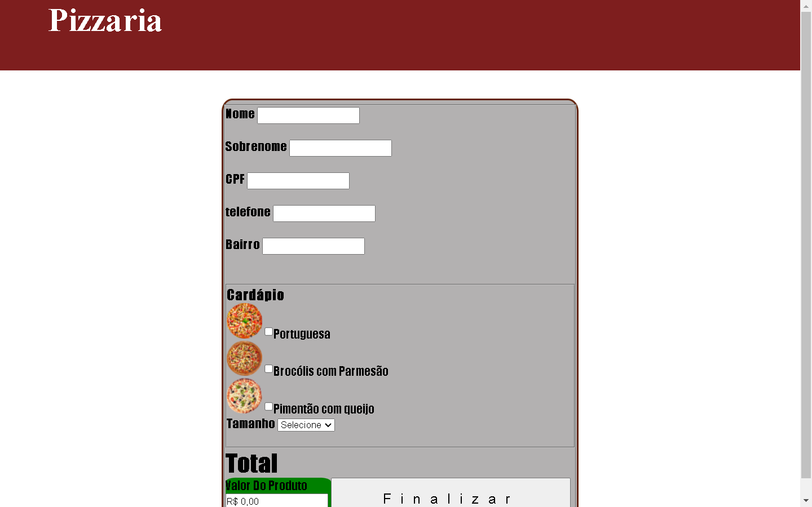
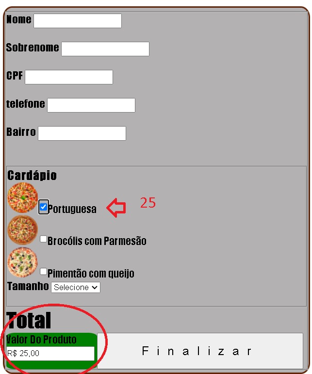
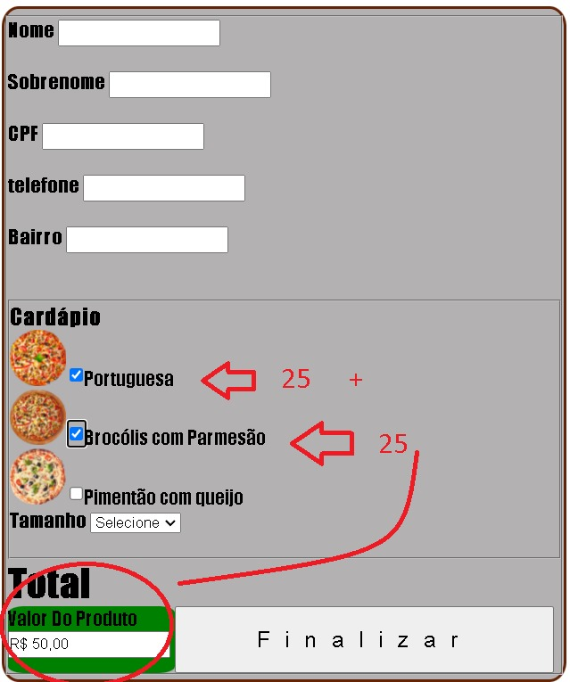
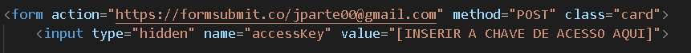
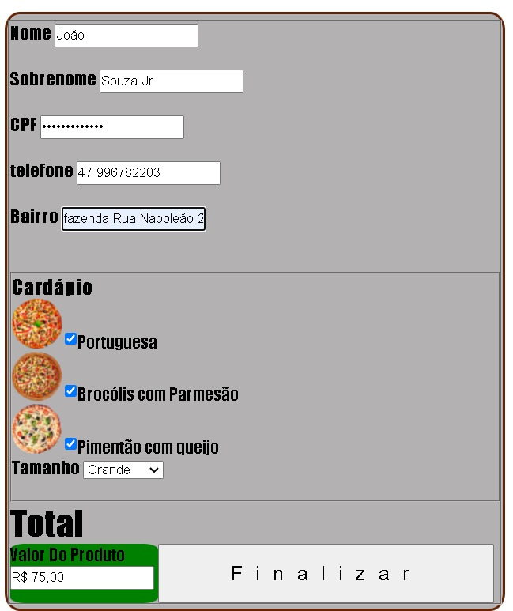
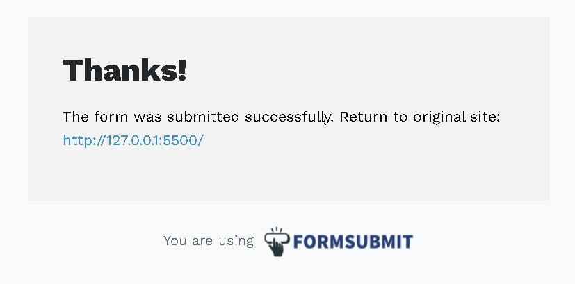
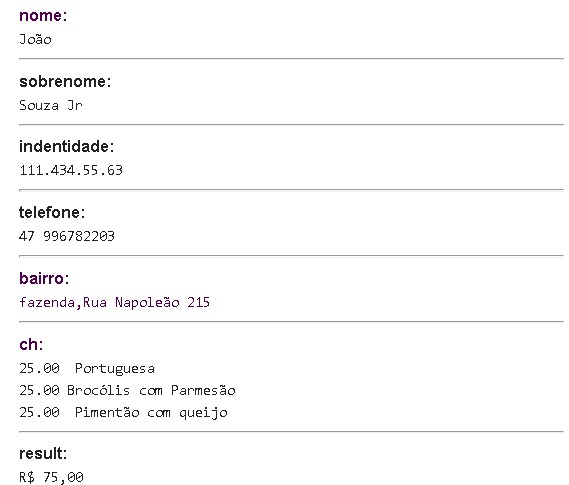

Projeto site E-Commerce simples
Desenvolvido Pelos Alunos /Jean Paulo / Márcio Henrique / MATHEUS MATTOS VEGINI / Rafael

layout simples e objetivo.

com intuito de se tornar facil pro cliente , até mesmo os Leigos em internet consegue realizar a compra.

foi usado javascript , para fazer a soma dos protudos,e o codigo formatMoney para formatar o valor em Reais.

exemplos >

no sistema de Crud usamos plataforma formsubmit que pega as informações envia direto para seu Email Pessoal , como forma de simplificar e deixar projeto mais leve e Poucos Codigos.

exemplo de Codigo >

com algumas linhas você tem um sistema de informações rapida e facil , podendo depois acoplar um banco de dados da sua preferencía.

veja os exemplos >

quando finalizamos e apertamos o botão para enviar as informações abre uma nova janela redirecionando para a plataforma.

essa plataforma ja envia as informações para o email com os dados do cliente.

